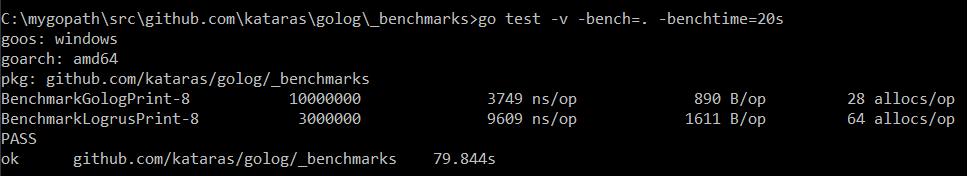

# Running the benchmarks

```bash
$ cd $GOPATH/src/github.com/kataras/golog/_benchmarks
$ go get ./...
$ go test -v -bench=. -benchtime=20s
```

# Results

| test | times ran (large is better) |  ns/op (small is better) | B/op (small is better) | allocs/op (small is better) |
| -----------|--------|-------------|-------------|-------------|
| **BenchmarkGologPrint** | 10000000 | 3749 ns/op | 890 B/op | 28 allocs/op |
| BenchmarkLogrusPrint | &nbsp; 3000000 | 9609 ns/op | 1611 B/op | 64 allocs/op |

> Feel free to send a [PR](https://github.com/kataras/golog/pulls) of your own loger benchmark to put it here!

<details>
<summary>Details</summary>



Date: Su 30 July 2017

Processor: Intel(R) Core(TM) i7-4710HQ CPU @ 2.50GHz 2.50Ghz

Ram: 8.00GB
</details>